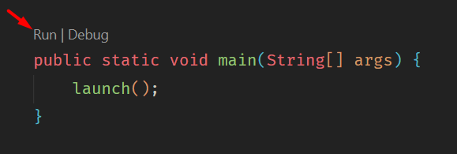
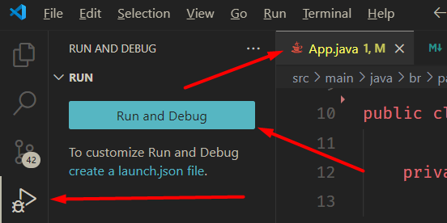

# ⚙️ Projeto Simulação de Paginação de Memória

**Objetivo:** Realizar uma simulação em Java do processo de paginação de memória, focando no tratamento de ocorrências de _page fault_.

## 🛠️ Tecnologias Utilizadas

- **Linguagem de Programação:** Java
- **Sistema de Build:** Maven
- **Framework de Interface de Usuário:** JavaFX

## 🚀 Requisitos para Execução

Para executar o programa com sucesso, certifique-se de ter as seguintes dependências instaladas e corretamente configuradas em seu sistema:

### 📚 Bibliotecas

- **Java Development Kit (JDK):**
  - **Versão:** 21
  - **Download:** [https://www.oracle.com/java/technologies/downloads/#java21](https://www.oracle.com/java/technologies/downloads/#java21)
- **JavaFX:**
  - **Versão:** 13.0
  - **Documentação e Download:** [https://openjfx.io/openjfx-docs/](https://openjfx.io/openjfx-docs/)
  - **OBS:** To
- **Apache Maven:**
  - **Versão:** 3.8.0
  - **Download:** [https://maven.apache.org/download.cgi](https://maven.apache.org/download.cgi)

### 💻 Ambiente de Desenvolvimento

Todo o desenvolvimento e testes foram realizados no seguinte ambiente:

- **IDE:** Visual Studio Code (VS Code)
- **Sistema Operacional:** Windows 11

### 🔌 Extensões VS Code

Para uma melhor experiência de desenvolvimento em Java no VS Code, a seguinte extensão é recomendada:

- **Extension Pack for Java:**
  - **Link:** [https://marketplace.visualstudio.com/items?itemName=vscjava.vscode-java-pack](https://marketplace.visualstudio.com/items?itemName=vscjava.vscode-java-pack)

## 🚀 Execução do Programa

Para iniciar a simulação após configurar o ambiente e as dependências:

1. **Rode o seguinte comando no terminal:**
   Execute `mvn dependency:resolve` no terminal para garantir que todas as dependências sejam baixadas. Teoricamente o Maven já faz isso na primeira vez que o programa roda, mas não custa nada garantir.

2. **Navegue até o arquivo principal:**
   Localize o diretório `src/main/java/br/paginacao/` e, dentro dele, encontre o arquivo `App.java`.

3. **Execute diretamente na IDE (Recomendado):**

   - **Visual Studio Code:**

     - **Opção 1: Usar o botão "Run"**: Se você estiver utilizando o VS Code com o "Extension Pack for Java" instalado, abra o arquivo `App.java`. Acima da declaração da classe principal (ou dentro do método `main`), você deverá ver a opção "**Run**". Clique neste botão para compilar e executar o programa.

   ## 

   - **Opção 2: Ir para "Run and Debug"**: Na barra lateral do VS Code, clique no ícone de "Run and Debug" (geralmente parece um inseto com um play). Uma vez na visualização de "Run and Debug", deverá haver um botão chamado Run and Debug. Clique neste botão para iniciar o programa.

   ## 

   - **Outras IDEs:** IDEs como IntelliJ IDEA ou Eclipse também oferecem funcionalidades semelhantes para executar arquivos Java diretamente através de botões de "Run" ou opções de "Debug".

**Observações Importantes:**

- Certifique-se de que a variável de ambiente `JAVA_HOME` esteja configurada corretamente apontando para a instalação do seu JDK 21.
- O Maven cuidará do gerenciamento das dependências do JavaFX conforme definido no arquivo `pom.xml`. Você não precisa baixar o JavaFX separadamente se estiver utilizando o Maven corretamente.

---
